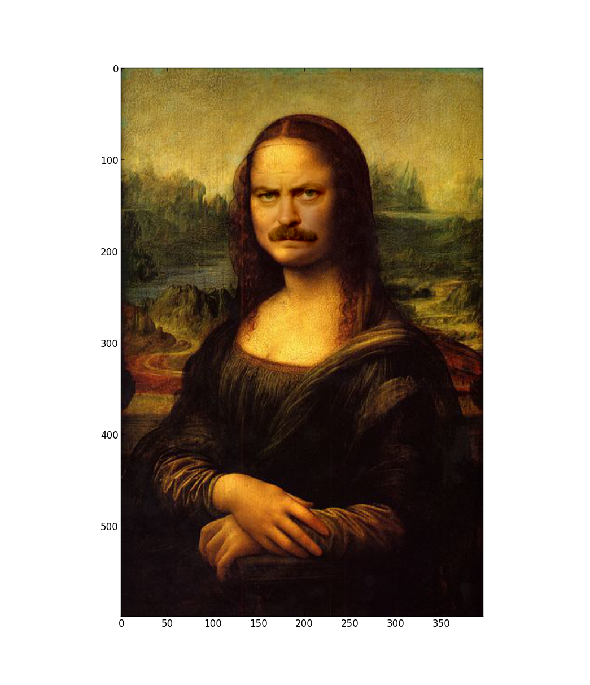

Gradient Domain Cloning
=========

This is my implementation of Gradient Domain Cloning for [Homework 2 for UVA CS 6501 Computation Photography with Prof. Connelly Barnes](http://www.connellybarnes.com/work/class/2014/comp_photo/proj2/).

My code has the following dependencies:

- Python 2.7.5
- Numpy 1.6.2
- matplotlib 1.1.1
- scikit-image 0.10.1

I've included some useful variables to set at the top of quilt.py, in the 'globals' section starting on line 18:

- BACKGROUND_IMG - a string filepath to the background image you want to use
- FOREGROUND_IMG - a string filepath to the foreground image you want to use
- MATTE_IMG - a string filepath to the matte image you want to use

You can feel free to use this code for whatever you want, with the following stipulations:

1. This code cannot be used in any product that is sold
2. You must reference me if you use this code
3. If you're currently in CS 6501, don't use this code to cheat.

Copyright Sam Prestwood, 2014